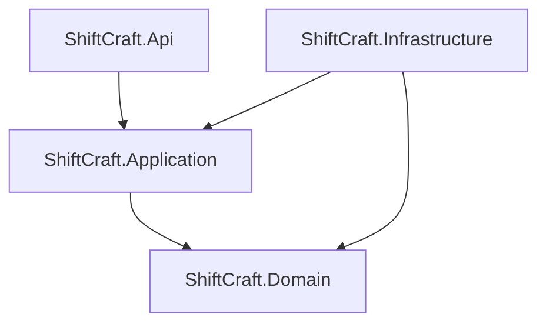
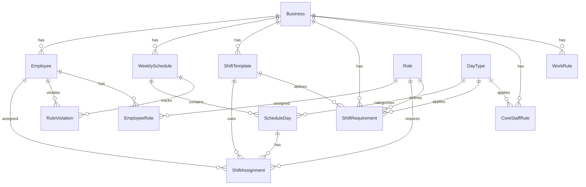

# Design Document

## Overview

ShiftCraft, .NET 8 ve Clean Architecture kullanılarak geliştirilecek bir vardiya yönetim sistemidir. Sistem, işletmelerin çalışan vardiyalarını planlamasını, iş kurallarını uygulamasını ve kural ihlallerini takip etmesini sağlar.

## Architecture

### Clean Architecture Layers



**Dependency Rules:**
- Domain: ZERO external dependencies
- Application: Depends only on Domain
- Infrastructure: Depends on Domain and Application
- API: Depends on Application

### Project Structure

```
ShiftCraft/
├── src/
│   ├── ShiftCraft.Domain/
│   │   ├── Entities/
│   │   └── Enums/
│   ├── ShiftCraft.Application/
│   │   ├── Interfaces/
│   │   ├── Services/
│   │   └── DTOs/
│   ├── ShiftCraft.Infrastructure/
│   │   ├── Data/
│   │   ├── Configurations/
│   │   └── Repositories/
│   └── ShiftCraft.Api/
│       ├── Controllers/
│       └── Extensions/
```

## Components and Interfaces

### Domain Layer - Entities (13 tables)

1. **Business**: Id, Name, Timezone
2. **Employee**: Id, BusinessId, Name, IsCoreStaff, WeeklyMaxMinutes, IsActive
3. **Role**: Id, Name
4. **EmployeeRole**: EmployeeId, RoleId (composite PK)
5. **DayType**: Id, Code
6. **ShiftTemplate**: Id, BusinessId, Name, StartTime, EndTime, DurationMinutes
7. **WeeklySchedule**: Id, BusinessId, WeekStartDate, Status
8. **ScheduleDay**: Id, WeeklyScheduleId, Date, DayTypeId
9. **ShiftAssignment**: Id, ScheduleDayId, EmployeeId, RoleId, ShiftTemplateId, Source
10. **ShiftRequirement**: Id, BusinessId, DayTypeId, RoleId, ShiftTemplateId, RequiredCount
11. **CoreStaffRule**: Id, BusinessId, DayTypeId, MinCoreStaffCount
12. **WorkRule**: Id, BusinessId, IsSevenDaysOpen, MaxDailyMinutes, MinWeeklyOffDays
13. **RuleViolation**: Id, WeeklyScheduleId, EmployeeId, ViolationDate, RuleCode

### Domain Layer - Enums

- **ScheduleStatus**: Draft = 0, Published = 1, Archived = 2
- **ShiftSource**: Manual = 0, AutoGenerated = 1, Swapped = 2
- **DayTypeCode**: Weekday = 0, Weekend = 1, Holiday = 2
- **RuleCode**: MaxDailyMinutes = 0, WeeklyOffDays = 1, CoreStaffMinimum = 2

### Application Layer - Interfaces

**Repository Interfaces:**
- IBusinessRepository
- IEmployeeRepository
- IRoleRepository
- IEmployeeRoleRepository
- IDayTypeRepository
- IShiftTemplateRepository
- IWeeklyScheduleRepository
- IScheduleDayRepository
- IShiftAssignmentRepository
- IShiftRequirementRepository
- ICoreStaffRuleRepository
- IWorkRuleRepository
- IRuleViolationRepository

**Service Interfaces:**
- IRuleEngineService
- IScheduleValidationService

### Infrastructure Layer

**DbContext:** ShiftCraftDbContext with DbSets for all 13 entities

**Entity Configurations (FK + CASCADE rules from UML):**
- Business → Employee: NO ACTION
- Business → WeeklySchedule: NO ACTION
- Business → ShiftTemplate: NO ACTION
- Business → ShiftRequirement: NO ACTION
- Business → CoreStaffRule: NO ACTION
- Business → WorkRule: NO ACTION
- WeeklySchedule → ScheduleDay: CASCADE
- ScheduleDay → ShiftAssignment: CASCADE
- WeeklySchedule → RuleViolation: CASCADE
- Employee → ShiftAssignment: NO ACTION
- Employee → RuleViolation: NO ACTION
- Employee → EmployeeRole: CASCADE
- Role → EmployeeRole: NO ACTION
- Role → ShiftAssignment: NO ACTION
- ShiftTemplate → ShiftAssignment: NO ACTION
- DayType → ScheduleDay: NO ACTION
- DayType → ShiftRequirement: NO ACTION
- DayType → CoreStaffRule: NO ACTION
- Role → ShiftRequirement: NO ACTION
- ShiftTemplate → ShiftRequirement: NO ACTION

## Data Models

### Entity Relationships




## Correctness Properties

*A property is a characteristic or behavior that should hold true across all valid executions of a system.*

### Property 1: Entity Association Validation
*For any* entity creation with foreign key relationships, the system should validate that all referenced entities exist before allowing creation.
**Validates: Requirements 2.1, 5.1, 6.1, 7.1, 8.1, 9.1, 10.1, 11.1, 12.2**

### Property 2: Cascade Delete Consistency
*For any* parent entity deletion with CASCADE rules, all child entities should be automatically deleted (WeeklySchedule→ScheduleDay→ShiftAssignment, WeeklySchedule→RuleViolation, Employee→EmployeeRole).
**Validates: Requirements 3.3, 6.4, 7.3, 12.5**

### Property 3: Referential Integrity Protection
*For any* entity deletion with NO ACTION rules, the system should prevent deletion when dependent records exist.
**Validates: Requirements 1.3, 2.5, 3.4, 4.3, 5.4, 8.4**

### Property 4: Enum Value Validation
*For any* entity with enum fields, the system should only accept valid enum values (ScheduleStatus, ShiftSource, DayTypeCode, RuleCode).
**Validates: Requirements 6.3, 8.2, 12.4**

### Property 5: MaxDailyMinutes Rule Validation
*For any* employee on any day, the total assigned shift duration should not exceed the WorkRule.MaxDailyMinutes value.
**Validates: Requirements 10.3, 13.1**

### Property 6: MinWeeklyOffDays Rule Validation
*For any* employee in any week, the number of days without shift assignments should be at least WorkRule.MinWeeklyOffDays.
**Validates: Requirements 10.4, 13.2**

### Property 7: CoreStaffMinimum Rule Validation
*For any* schedule day, the number of assigned core staff employees should be at least CoreStaffRule.MinCoreStaffCount for that day type.
**Validates: Requirements 11.2, 13.3**

### Property 8: Shift Duration Consistency
*For any* shift template, the DurationMinutes should equal the difference between EndTime and StartTime.
**Validates: Requirements 5.3**

### Property 9: Violation Record Creation
*For any* detected rule violation, the system should create a RuleViolation record with correct associations and rule code.
**Validates: Requirements 12.1, 13.4**

### Property 10: Schedule Status Transition Validation
*For any* schedule status change to Published, the system should run all rule validations and create violation records.
**Validates: Requirements 13.5**

## Error Handling

### Domain Layer
- Domain entities throw ArgumentException for invalid values
- No external dependencies in error handling

### Application Layer
- Services return Result<T> pattern for operation outcomes
- Validation errors collected and returned as structured responses

### Infrastructure Layer
- DbUpdateException caught and translated to domain exceptions
- Transaction rollback on failures

### API Layer
- Global exception handler middleware
- Structured error responses with HTTP status codes
- FluentValidation for request validation

## Testing Strategy

### Property-Based Testing
- **Framework**: FsCheck for .NET
- **Iterations**: Minimum 100 per property test
- **Tag Format**: Feature: vardiyax-clean-architecture, Property {N}: {description}

### Unit Testing
- **Framework**: xUnit with FluentAssertions
- **Coverage**: Entity validation, service logic, rule engine

### Integration Testing
- **Database**: In-memory SQLite for fast tests
- **Scope**: Repository implementations, DbContext configurations