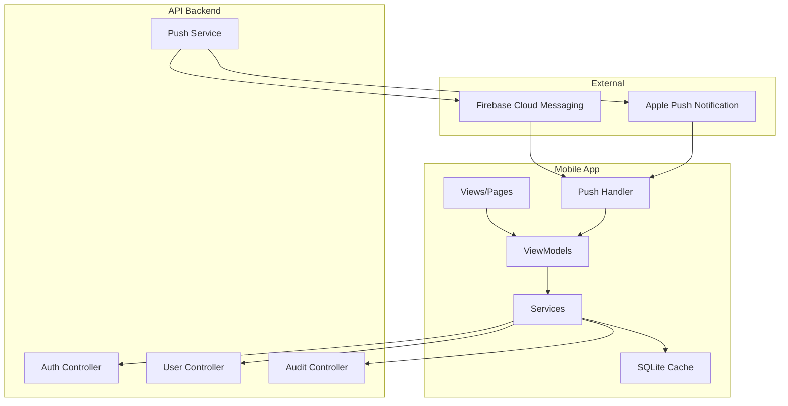

# Design Document: VardiyaX Mobile Advanced Features

## Overview

Bu tasarım, VardiyaX mobil uygulaması için gelişmiş özellikleri kapsar: kullanıcı yönetimi, denetim günlükleri, push bildirimleri ve çevrimdışı okuma modu. Mevcut .NET MAUI mimarisi üzerine inşa edilecek ve API backend ile entegre çalışacaktır.

## Architecture



## Components and Interfaces

### 1. User Management Module

#### API Endpoints (Backend)

```csharp
// POST /api/v1/user
public interface IUserController
{
    Task<ActionResult<UserDto>> CreateUser(CreateUserRequest request);
    Task<ActionResult<IEnumerable<UserDto>>> GetUsers();
    Task<ActionResult<UserDto>> GetUser(int id);
    Task<ActionResult> UpdateUser(int id, UpdateUserRequest request);
    Task<ActionResult> DeactivateUser(int id);
    Task<ActionResult> ResetPassword(int id);
}

public class CreateUserRequest
{
    public string Username { get; set; }
    public string Password { get; set; }
    public string Role { get; set; } // Admin, Manager, Worker, Trainee
}

public class UpdateUserRequest
{
    public string? Role { get; set; }
    public bool? IsActive { get; set; }
}

public class UserDto
{
    public int Id { get; set; }
    public string Username { get; set; }
    public string Role { get; set; }
    public bool IsActive { get; set; }
    public bool MustChangePassword { get; set; }
    public DateTime CreatedAt { get; set; }
    public DateTime? LastLoginAt { get; set; }
}

// Auth response includes full user context
public class LoginResponse
{
    public string Token { get; set; }
    public DateTime ExpiresAt { get; set; }
    public UserContextDto User { get; set; }
}

// Single source of truth for user context
public class UserContextDto
{
    public int UserId { get; set; }
    public string Username { get; set; }
    public string Role { get; set; }
    public int BusinessId { get; set; }
    public string BusinessName { get; set; }
}
```

#### Mobile Service

```csharp
public interface IUserService
{
    Task<IEnumerable<UserDto>> GetUsersAsync();
    Task<UserDto> CreateUserAsync(CreateUserRequest request);
    Task UpdateUserAsync(int id, UpdateUserRequest request);
    Task DeactivateUserAsync(int id);
    Task ResetPasswordAsync(int id);
}
```

### 2. Audit Log Module

#### API Endpoints (Backend)

```csharp
// GET /api/v1/audit/login
// GET /api/v1/audit/publish
// GET /api/v1/audit/violations
public interface IAuditController
{
    Task<ActionResult<PagedResult<LoginLogDto>>> GetLoginLogs(
        string? username, DateTime? from, DateTime? to, int page = 1, int pageSize = 20);
    Task<ActionResult<PagedResult<PublishLogDto>>> GetPublishLogs(
        string? publisher, DateTime? from, DateTime? to, int page = 1, int pageSize = 20);
    Task<ActionResult<PagedResult<ViolationLogDto>>> GetViolationHistory(
        int? employeeId, string? ruleType, DateTime? from, DateTime? to, int page = 1, int pageSize = 20);
    Task<ActionResult<ViolationTrendsDto>> GetViolationTrends(DateTime from, DateTime to);
    Task<ActionResult> AcknowledgeViolation(int violationId);
}

public class LoginLogDto
{
    public int Id { get; set; }
    public string Username { get; set; }
    public DateTime Timestamp { get; set; }
    public string Action { get; set; } // Login, Logout, FailedLogin
    public string? DeviceInfo { get; set; }
    public string? FailureReason { get; set; }
}

public class PublishLogDto
{
    public int Id { get; set; }
    public string PublisherUsername { get; set; }
    public DateTime Timestamp { get; set; }
    public DateTime WeekStartDate { get; set; }
    public int AffectedEmployeeCount { get; set; }
}

public class ViolationLogDto
{
    public int Id { get; set; }
    public DateTime ViolationDate { get; set; }
    public string EmployeeName { get; set; }
    public string RuleType { get; set; }
    public bool IsAcknowledged { get; set; }
    public DateTime? AcknowledgedAt { get; set; }
}

public class ViolationTrendsDto
{
    public List<TrendPoint> WeeklyTrends { get; set; }
    public List<TrendPoint> MonthlyTrends { get; set; }
}

public class TrendPoint
{
    public DateTime Period { get; set; }
    public int Count { get; set; }
}
```

#### Mobile Service

```csharp
public interface IAuditService
{
    Task<PagedResult<LoginLogDto>> GetLoginLogsAsync(LoginLogFilter filter);
    Task<PagedResult<PublishLogDto>> GetPublishLogsAsync(PublishLogFilter filter);
    Task<PagedResult<ViolationLogDto>> GetViolationHistoryAsync(ViolationFilter filter);
    Task<ViolationTrendsDto> GetViolationTrendsAsync(DateTime from, DateTime to);
    Task AcknowledgeViolationAsync(int violationId);
}
```

### 3. Push Notification Module

#### Backend Push Service

```csharp
public interface IPushNotificationService
{
    Task SendSchedulePublishedNotification(int weeklyScheduleId, List<int> employeeIds);
    Task SendViolationDetectedNotification(int violationId, List<int> managerIds);
    Task ScheduleShiftReminder(int shiftAssignmentId, int employeeId, DateTime shiftStart);
    Task CancelShiftReminder(int shiftAssignmentId);
}

public class PushNotificationPayload
{
    public string Title { get; set; }
    public string Body { get; set; }
    public string Action { get; set; } // navigate_schedule, navigate_violations
    public Dictionary<string, string> Data { get; set; }
}
```

#### Mobile Push Handler

```csharp
public interface IPushNotificationHandler
{
    Task RegisterDeviceAsync(string deviceToken);
    Task UnregisterDeviceAsync();
    Task<NotificationPreferences> GetPreferencesAsync();
    Task UpdatePreferencesAsync(NotificationPreferences preferences);
    void HandleNotificationReceived(PushNotificationPayload payload);
    void HandleNotificationTapped(PushNotificationPayload payload);
}

public class NotificationPreferences
{
    public bool ScheduleNotificationsEnabled { get; set; } = true;
    public bool ViolationNotificationsEnabled { get; set; } = true;
    public bool ShiftRemindersEnabled { get; set; } = true;
    public int ReminderHoursBefore { get; set; } = 24; // 1, 24
}
```

### 4. Offline Cache Module

#### SQLite Cache Service

```csharp
public interface ICacheService
{
    // Schedule caching
    Task CacheScheduleAsync(WeeklyScheduleDto schedule);
    Task<WeeklyScheduleDto?> GetCachedScheduleAsync(DateTime weekStart);
    Task<List<WeeklyScheduleDto>> GetAllCachedSchedulesAsync();
    Task ClearOldCacheAsync(int keepWeeks = 4);
    
    // Sync management
    Task<DateTime?> GetLastSyncTimeAsync();
    Task SetLastSyncTimeAsync(DateTime syncTime);
    Task<bool> HasCachedDataAsync();
}

public interface IConnectivityService
{
    bool IsOnline { get; }
    event EventHandler<bool> ConnectivityChanged;
    Task<bool> CheckConnectivityAsync();
}

public interface IOfflineModeService
{
    bool IsOfflineMode { get; }
    Task<T> ExecuteWithOfflineSupportAsync<T>(
        Func<Task<T>> onlineAction,
        Func<Task<T>> offlineAction);
    Task ExecuteWriteOperationAsync(Func<Task> action);
}
```

## Data Models

### User Entity (Backend)

```csharp
public class User
{
    public int Id { get; set; }
    public string Username { get; set; }
    public string PasswordHash { get; set; }
    public string Role { get; set; }
    public bool IsActive { get; set; }
    public bool MustChangePassword { get; set; }
    public DateTime CreatedAt { get; set; }
    public DateTime? LastLoginAt { get; set; }
    public int? BusinessId { get; set; }
}
```

### Audit Log Entities (Backend)

```csharp
public class LoginLog
{
    public int Id { get; set; }
    public string Username { get; set; }
    public DateTime Timestamp { get; set; }
    public string Action { get; set; } // Login, Logout, FailedLogin
    public string? DeviceInfo { get; set; }
    public string? FailureReason { get; set; }
    public string? IpAddress { get; set; }
}

public class PublishLog
{
    public int Id { get; set; }
    public int WeeklyScheduleId { get; set; }
    public string PublisherUsername { get; set; }
    public DateTime Timestamp { get; set; }
    public int AffectedEmployeeCount { get; set; }
}
```

### Device Registration (Backend)

```csharp
public class DeviceRegistration
{
    public int Id { get; set; }
    public int UserId { get; set; }
    public string DeviceToken { get; set; }
    public string Platform { get; set; } // Android, iOS, Windows
    public DateTime RegisteredAt { get; set; }
    public DateTime? LastActiveAt { get; set; }
}
```

### SQLite Cache Models (Mobile)

```csharp
[Table("CachedSchedules")]
public class CachedSchedule
{
    [PrimaryKey]
    public string WeekKey { get; set; } // Format: yyyy-MM-dd
    public string JsonData { get; set; }
    public DateTime CachedAt { get; set; }
}

[Table("SyncMetadata")]
public class SyncMetadata
{
    [PrimaryKey]
    public string Key { get; set; }
    public string Value { get; set; }
}
```

## Correctness Properties

*A property is a characteristic or behavior that should hold true across all valid executions of a system-essentially, a formal statement about what the system should do. Properties serve as the bridge between human-readable specifications and machine-verifiable correctness guarantees.*

### Property 1: Username Uniqueness
*For any* two users in the system, their usernames SHALL be different (case-insensitive).
**Validates: Requirements 1.3**

### Property 2: Role-Based Access Control
*For any* API request to user management endpoints, if the requesting user's role is not Admin, the request SHALL return 403 Forbidden.
**Validates: Requirements 1.6**

### Property 3: Deactivated User Login Prevention
*For any* deactivated user, attempting to login SHALL return authentication failure regardless of correct credentials.
**Validates: Requirements 1.5**

### Property 4: Password Validation
*For any* password string, it SHALL be accepted only if it has at least 8 characters AND contains at least one digit.
**Validates: Requirements 2.3**

### Property 5: Login Audit Completeness
*For any* successful login, the created LoginLog entry SHALL contain non-null username, timestamp, and action="Login".
**Validates: Requirements 3.1**

### Property 6: Audit Log Ordering
*For any* query to login logs without explicit sorting, the results SHALL be ordered by timestamp descending.
**Validates: Requirements 3.4**

### Property 7: Audit Log Filtering
*For any* filter applied to audit logs (username, date range), all returned results SHALL match the filter criteria.
**Validates: Requirements 3.6, 4.3, 5.2**

### Property 8: Publish Log Content
*For any* schedule publish event, the created PublishLog SHALL contain publisher username, timestamp, week start date, and affected employee count > 0.
**Validates: Requirements 4.1, 4.2**

### Property 9: Violation Trend Calculation
*For any* date range query for violation trends, the sum of weekly trend counts SHALL equal the total violations in that range.
**Validates: Requirements 5.3**

### Property 10: Notification Targeting - Schedule Published
*For any* schedule publish event, push notifications SHALL be sent only to employees who have shifts in that schedule AND have schedule notifications enabled.
**Validates: Requirements 6.1, 6.4**

### Property 11: Notification Targeting - Violations
*For any* rule violation detection, push notifications SHALL be sent only to users with Manager or Admin role AND have violation notifications enabled.
**Validates: Requirements 7.1, 7.4**

### Property 12: Shift Reminder Scheduling
*For any* shift assignment, if the employee has reminders enabled, reminder notifications SHALL be scheduled at (shiftStart - reminderHours).
**Validates: Requirements 8.1, 8.2, 8.4**

### Property 13: Cancelled Shift No Reminder
*For any* cancelled shift assignment, no reminder notifications SHALL be sent.
**Validates: Requirements 8.5**

### Property 14: Cache Scope
*For any* online schedule view, the cache SHALL contain at least the current week and next week's schedules.
**Validates: Requirements 9.4**

### Property 15: Offline Read Access
*For any* cached schedule, when the device is offline, the schedule data SHALL be retrievable from cache.
**Validates: Requirements 9.2, 10.1**

### Property 16: Offline Write Prevention
*For any* write operation (create, update, delete) attempted while offline, the operation SHALL fail with disabled buttons and non-blocking toast (no modal alerts).
**Validates: Requirements 10.2, 10.4, 10.5**

### Property 17: Auto-Sync on Reconnect
*For any* transition from offline to online state, the cache SHALL be refreshed within 30 seconds.
**Validates: Requirements 9.5, 10.6**

### Property 18: Multi-Tenant Data Isolation
*For any* API query (users, schedules, audit logs, violations), results SHALL only include data where BusinessId matches the requesting user's BusinessId.
**Validates: Requirements 11.1, 11.2, 11.3, 11.4**

### Property 19: Cross-Business Access Prevention
*For any* attempt to access data with a different BusinessId than the requesting user, the API SHALL return 403 Forbidden.
**Validates: Requirements 11.5, 11.6**

## Error Handling

### API Error Responses

```csharp
public class ApiErrorResponse
{
    public string Code { get; set; }
    public string Message { get; set; }
    public Dictionary<string, string[]>? ValidationErrors { get; set; }
}

// Error codes
public static class ErrorCodes
{
    public const string UserNotFound = "USER_NOT_FOUND";
    public const string UsernameExists = "USERNAME_EXISTS";
    public const string InvalidPassword = "INVALID_PASSWORD";
    public const string UserDeactivated = "USER_DEACTIVATED";
    public const string AccessDenied = "ACCESS_DENIED";
    public const string OfflineMode = "OFFLINE_MODE";
    public const string CacheNotFound = "CACHE_NOT_FOUND";
}
```

### Mobile Error Handling

```csharp
public class OfflineException : Exception
{
    public OfflineException() 
        : base("Çevrimdışı - Bu işlem internet bağlantısı gerektirir") { }
}

public class AuthorizationException : Exception
{
    public AuthorizationException() 
        : base("Bu işlem için yetkiniz yok") { }
}

public class CrossBusinessAccessException : Exception
{
    public CrossBusinessAccessException()
        : base("Bu veriye erişim yetkiniz yok") { }
}
```

### Offline UX Contract

```csharp
// Offline write attempt behavior (NO modal alerts)
public interface IOfflineUxBehavior
{
    // 1. Disable action buttons when offline
    void DisableWriteButtons();
    
    // 2. Show non-blocking toast on write attempt
    void ShowOfflineToast(string message);
    
    // 3. Re-enable buttons when online
    void EnableWriteButtons();
}

// Toast message: "Çevrimdışı - Bu işlem internet bağlantısı gerektirir"
// Duration: 3 seconds, position: bottom
}
```

## Testing Strategy

### Unit Tests
- Password validation logic
- Role permission checks
- Cache serialization/deserialization
- Notification payload construction
- Filter query building

### Property-Based Tests
Using FsCheck for .NET:

1. **Username uniqueness** - Generate random usernames, verify no duplicates accepted
2. **Password validation** - Generate random strings, verify validation rules
3. **Audit log ordering** - Generate random logs, verify sorting
4. **Filter correctness** - Generate random data and filters, verify results match
5. **Offline write prevention** - Generate random write operations, verify all fail offline
6. **Cache round-trip** - Generate random schedules, verify cache/retrieve equality

### Integration Tests
- Full login flow with audit logging
- User CRUD with role checks
- Push notification delivery (mock FCM/APNS)
- Offline mode transitions

### Configuration
- Property tests: minimum 100 iterations
- Test tag format: **Feature: vardiyax-mobile-advanced, Property {number}: {property_text}**
